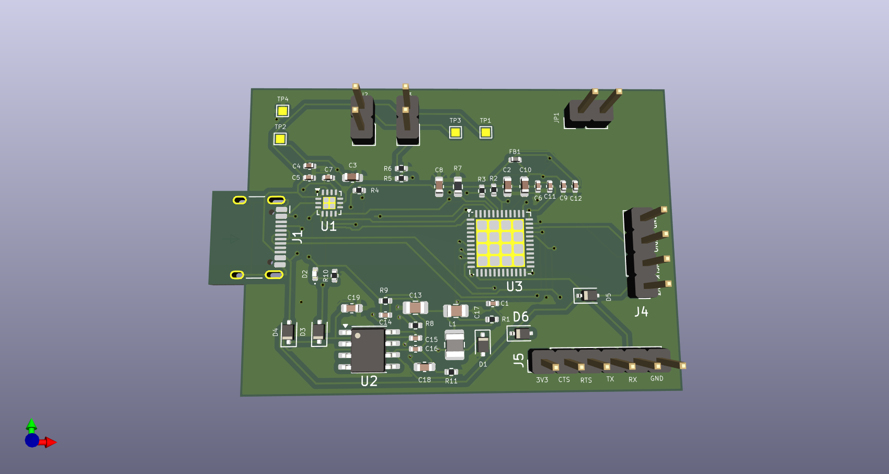
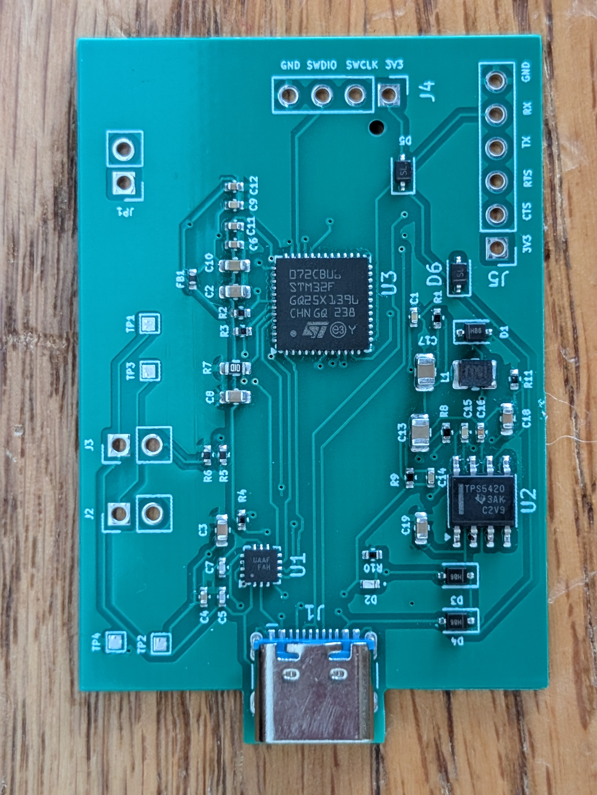

### Description
A development board to experiment with USB-C PD via an STM32 and FUSB302. 
The firmware is currently just a simple program to communicate over UART to
the STM32 and send I2C commands to the FUSB302. 
My goal is to implement a simple tool for sniffing USB-C PD packets.

**pd_sniffer firmware not ready, still WIP*

### Dev Board

